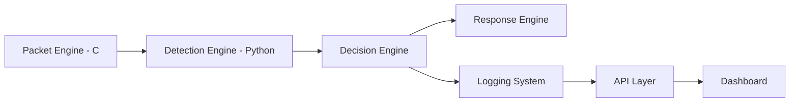
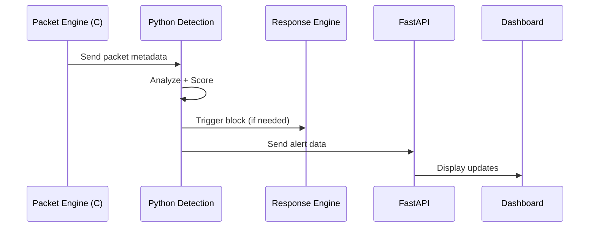

#  NLightweight Autonomous Intrusion Detection and Response System (LA-IDRS)

> Plug-and-play, self-defending network intrusion detection system designed for small-scale environments.

---

##  Overview

**NetSentinel** is a multi-language, real-time network security system that:

* Monitors network traffic at packet level
* Detects intrusions using rule-based and behavioral analysis
* Automatically blocks malicious actors
* Provides live monitoring via API and dashboard

Designed for:

* Small businesses
* College labs
* Personal/home networks

---

##  Key Features

*  Real-time packet capture (C - libpcap)
*  Rule-based + behavior-based detection
*  Automatic IP blocking (iptables)
*  REST API for monitoring (FastAPI)
*  Lightweight dashboard (JavaScript)
*  Plug-and-play deployment

---

## Architecture



---

##  Data Flow



---

##  Detection Strategy

###  Signature-Based

* Port scanning
* SYN flood
* Suspicious flags

### 🔹 Behavior-Based

* Packet rate anomalies
* Repeated connection attempts
* Unusual port access patterns

### 🔹 Risk Scoring

Each IP is assigned a score based on behavior:

* Low → Log
* Medium → Alert
* High → Block

---

##  Tech Stack

| Layer            | Technology            |
| ---------------- | --------------------- |
| Packet Capture   | C (libpcap)           |
| Detection Engine | Python                |
| Response Engine  | Bash + Python         |
| API              | FastAPI               |
| Dashboard        | HTML, CSS, JavaScript |
| OS               | Linux                 |

---

##  Installation

```bash
git clone https://github.com/your-username/netsentinel-laidrs.git
cd netsentinel-laidrs
chmod +x scripts/setup.sh
./scripts/setup.sh
```

---

##  Run

```bash
sudo ./scripts/run.sh
```

---

##  Example Use Case

1. Attacker runs:

```bash
nmap -sS <target>
```

2. LA-IDRS:

* Detects scan behavior
* Assigns high risk score
* Blocks IP automatically
* Logs event
* Displays alert in dashboard

---

##  Project Structure

```bash
packet_engine/      # C packet capture
detection_engine/   # Detection logic
response_engine/    # Auto-blocking
api/                # FastAPI backend
dashboard/          # Frontend UI
comms/              # IPC layer
```

```text
netsentinel-laidrs/
│
├── packet_engine/                  # C Layer (libpcap)
│   ├── src/
│   │   ├── capture.c
│   │   ├── parser.c
│   │   ├── emitter.c
│   │   └── main.c
│   │
│   ├── include/
│   │   ├── capture.h
│   │   ├── parser.h
│   │   └── emitter.h
│   │
│   ├── build/
│   ├── Makefile
│   └── README.md
│
├── detection_engine/
│   ├── core/
│   │   ├── detector.py
│   │   ├── signature.py
│   │   ├── behavior.py
│   │   ├── scorer.py
│   │   └── decision.py
│   │
│   ├── rules/
│   │   ├── port_scan.json
│   │   ├── syn_flood.json
│   │   └── brute_force.json
│   │
│   ├── state/
│   │   ├── ip_state.py
│   │   └── cache.py
│   │
│   ├── utils/
│   │   ├── parser.py
│   │   └── logger.py
│   │
│   └── config.py
│
├── response_engine/
│   ├── core/
│   │   ├── blocker.py
│   │   ├── unblocker.py
│   │   └── scheduler.py
│   │
│   ├── firewall/
│   │   └── iptables.sh
│   │
│   └── state/
│       └── banned_ips.json
│
├── api/
│   ├── main.py
│   ├── routes/
│   ├── services/
│   └── schemas/
│
├── dashboard/
│   ├── index.html
│   ├── app.js
│   └── styles.css
│
├── comms/
│   ├── socket_server.py
│   └── protocol.md
│
├── orchestrator/
│   ├── runner.py
│   ├── supervisor.py
│   └── config_loader.py
│
├── data/
│   ├── logs/
│   ├── db/
│   └── runtime/
│
├── scripts/
│   ├── setup.sh
│   ├── run.sh
│   └── cleanup.sh
│
├── tests/
├── docs/
├── docker/
│
├── requirements.txt
├── .env
├── README.md
└── main.py

```
---

##  Disclaimer

This project is designed for:

* Educational purposes
* Small-scale deployments

Not intended as a replacement for enterprise IDS solutions.

---

##  Future Improvements

* Threat intelligence integration
* Distributed detection nodes
* Advanced anomaly detection
* SDN integration

---

##  License

MIT License

## Authors

Anish G Prabhu

Github Profile:https://github.com/ashpb07

Hithansh Arekere

Github Profile:https://github.com/hithansharekere-debug
