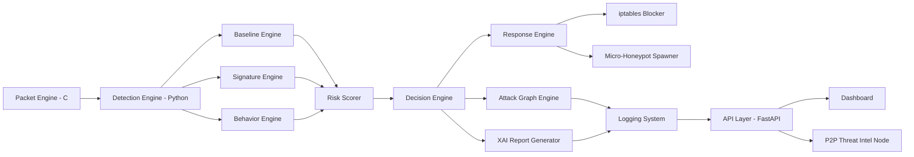
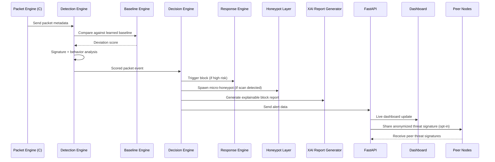

# NetSentinel — Lightweight Autonomous Intrusion Detection and Response System (LA-IDRS)

> A plug-and-play, self-defending network intrusion detection system designed for small-scale environments, with adaptive learning, attack graph reconstruction, and deception-layer capabilities.

---

## Overview

NetSentinel is a multi-language, real-time network security system that monitors traffic at the packet level, detects intrusions using both rule-based and behavioral analysis, and autonomously responds to threats — while explaining every decision it makes.

Designed for:

- Small businesses
- College labs and research environments
- Personal and home networks

---

## Key Features

- Real-time packet capture (C — libpcap)
- Signature-based and behavior-based detection
- Adaptive per-network baseline learning
- Causal attack graph reconstruction
- Dynamic micro-honeypot deception layer
- Automatic IP blocking via iptables
- Explainable block reports (XAI layer)
- Federated threat intelligence sharing (P2P, opt-in)
- REST API for monitoring (FastAPI)
- Lightweight live dashboard (JavaScript)
- Plug-and-play single-command deployment

---

## Architecture


```mermaid
flowchart LR
    A[Packet Engine - C] --> B[Detection Engine - Python]
    B --> C[Baseline Engine]
    B --> D[Signature Engine]
    B --> E[Behavior Engine]
    C & D & E --> F[Risk Scorer]
    F --> G[Decision Engine]
    G --> H[Response Engine]
    G --> I[Attack Graph Engine]
    G --> J[XAI Report Generator]
    H --> K[iptables Blocker]
    H --> L[Micro-Honeypot Spawner]
    I & J --> M[Logging System]
    M --> N[API Layer - FastAPI]
    N --> O[Dashboard]
    N --> P[P2P Threat Intel Node]
```

---

## Data Flow


```mermaid
sequenceDiagram
    participant C as Packet Engine (C)
    participant D as Detection Engine
    participant B as Baseline Engine
    participant G as Decision Engine
    participant R as Response Engine
    participant H as Honeypot Layer
    participant XAI as XAI Report Generator
    participant API as FastAPI
    participant UI as Dashboard
    participant P2P as Peer Nodes

    C->>D: Send packet metadata
    D->>B: Compare against learned baseline
    B-->>D: Deviation score
    D->>D: Signature + behavior analysis
    D->>G: Scored packet event
    G->>R: Trigger block (if high risk)
    G->>H: Spawn micro-honeypot (if scan detected)
    G->>XAI: Generate explainable block report
    G->>API: Send alert data
    API->>UI: Live dashboard update
    API->>P2P: Share anonymized threat signature (opt-in)
    P2P-->>API: Receive peer threat signatures
```

---

## Detection Strategy

### Signature-Based

- Port scanning (nmap, masscan fingerprints)
- SYN flood detection
- Malformed flag combinations
- Known bad user-agent and payload patterns

### Behavior-Based

- Packet rate anomalies against adaptive baseline
- Repeated connection attempts across ports
- Unusual port access sequences
- Protocol mismatch detection

### Adaptive Baseline Learning

On first deployment, NetSentinel runs a 24-hour passive observation phase to fingerprint normal traffic for that specific network. Thresholds for anomaly detection are derived from this baseline and updated continuously using an exponential moving average. This eliminates the false positives caused by static thresholds used by conventional tools.

### Risk Scoring

Each IP is assigned a cumulative risk score derived from weighted events:

| Score Range | Action |
|---|---|
| 0 - 30 | Log only |
| 31 - 70 | Alert via API |
| 71 - 100 | Auto-block via iptables |
| Honeypot contact | Instant block |

---

## Causal Attack Graph Engine

Rather than treating each suspicious event in isolation, NetSentinel correlates events across time and reconstructs a causal attack narrative. For example:

```
[SYN scan detected] --> [Service enumeration on port 22] --> [Brute force attempt] --> [Block triggered]
```

This graph is stored as a JSON structure and rendered in the dashboard as a visual timeline. It allows operators to understand the full context of an attack, not just the final trigger event. No lightweight open-source IDS currently provides this capability.

---

## Deception Layer — Micro-Honeypots

When port scanning behavior is detected, NetSentinel dynamically opens fake listener ports using lightweight Python sockets. Any connection to these ports is treated as a confirmed hostile action, producing a zero-false-positive block signal. The honeypot ports are randomized per session and closed automatically after the threat IP is blocked. This approach is found in enterprise tools such as Illusive Networks and Attivo, but has no equivalent in lightweight open-source tooling.

---

## XAI Block Reports

Every automated block generates a structured JSON report explaining the decision:

```json
{
  "ip": "192.168.1.45",
  "blocked_at": "2025-06-01T14:32:10Z",
  "risk_score": 87,
  "reasons": [
    "3 SYN scan events in 4 seconds",
    "Contacted 2 honeypot ports",
    "Matches known scanner fingerprint: nmap -sS"
  ],
  "attack_graph_id": "graph_20250601_143210"
}
```

These reports are accessible via the API and displayed in the dashboard. They can optionally be exported as PDFs for audit purposes.

---

## Federated Threat Intelligence (P2P, Opt-In)

NetSentinel nodes can optionally participate in a peer-to-peer threat sharing network. When a new attack pattern is confirmed, an anonymized signature is broadcast to peer nodes using a lightweight gossip protocol. Participating nodes absorb new signatures within minutes without requiring a central server. All IP data is stripped before sharing. This feature is disabled by default and must be explicitly enabled in configuration.

---

## Tech Stack

| Layer | Technology |
|---|---|
| Packet Capture | C (libpcap) |
| Detection Engine | Python |
| Baseline Engine | Python (numpy, statistics) |
| Attack Graph Engine | Python (networkx) |
| Deception Layer | Python (socket) |
| XAI Report Generator | Python |
| Response Engine | Bash + Python |
| Firewall Control | iptables |
| API | FastAPI |
| Dashboard | HTML, CSS, JavaScript |
| P2P Threat Intel | Python (asyncio, custom gossip) |
| OS | Linux |

---

## Installation

```bash
git clone https://github.com/your-username/netsentinel-laidrs.git
cd netsentinel-laidrs
chmod +x scripts/setup.sh
./scripts/setup.sh
```

---

## Run

```bash
sudo ./scripts/run.sh
```

On first run, the system enters a 24-hour baseline learning phase before active detection begins. This can be shortened in `config.py` for testing.

---

## Example Use Case

Attacker runs:

```bash
nmap -sS <target>
```

NetSentinel response sequence:

1. Packet engine detects SYN packets across multiple ports
2. Behavior engine scores the event against the learned baseline
3. Micro-honeypot spawner opens fake ports as a trap
4. Attacker connects to a honeypot port — instant block signal
5. Decision engine raises risk score to 95
6. Response engine calls iptables to block the IP
7. Attack graph is constructed: scan detected > honeypot contacted > blocked
8. XAI report is generated and pushed to the API
9. Dashboard displays the alert with full causal context
10. Anonymized signature is shared with peer nodes (if P2P is enabled)

---

## Project Structure

```
netsentinel-laidrs/
│
├── packet_engine/                  # C layer (libpcap)
│   ├── src/
│   │   ├── capture.c
│   │   ├── parser.c
│   │   ├── emitter.c
│   │   └── main.c
│   ├── include/
│   │   ├── capture.h
│   │   ├── parser.h
│   │   └── emitter.h
│   ├── build/
│   ├── Makefile
│   └── README.md
│
├── detection_engine/
│   ├── core/
│   │   ├── detector.py
│   │   ├── signature.py
│   │   ├── behavior.py
│   │   ├── scorer.py
│   │   └── decision.py
│   ├── baseline/
│   │   ├── learner.py              # 24-hour passive observation phase
│   │   ├── ema.py                  # Exponential moving average updater
│   │   └── profile.py             # Per-network traffic profile
│   ├── rules/
│   │   ├── port_scan.json
│   │   ├── syn_flood.json
│   │   └── brute_force.json
│   ├── state/
│   │   ├── ip_state.py
│   │   └── cache.py
│   ├── utils/
│   │   ├── parser.py
│   │   └── logger.py
│   └── config.py
│
├── attack_graph/
│   ├── builder.py                  # Constructs causal event graphs
│   ├── store.py                    # Persists graphs as JSON
│   └── renderer.py                 # Outputs graph data to API
│
├── deception/
│   ├── honeypot.py                 # Dynamic micro-honeypot spawner
│   ├── port_manager.py             # Randomized port selection and lifecycle
│   └── signal.py                   # Feeds confirmed contacts to decision engine
│
├── xai/
│   ├── report.py                   # Structured JSON/PDF block report generator
│   └── templates/
│       └── block_report.html
│
├── response_engine/
│   ├── core/
│   │   ├── blocker.py
│   │   ├── unblocker.py
│   │   └── scheduler.py
│   ├── firewall/
│   │   └── iptables.sh
│   └── state/
│       └── banned_ips.json
│
├── p2p/
│   ├── gossip.py                   # Anonymized signature broadcast protocol
│   ├── peer_registry.py            # Known peer node management
│   └── signature_sanitizer.py     # Strips IP data before sharing
│
├── api/
│   ├── main.py
│   ├── routes/
│   ├── services/
│   └── schemas/
│
├── dashboard/
│   ├── index.html
│   ├── app.js
│   └── styles.css
│
├── comms/
│   ├── socket_server.py
│   └── protocol.md
│
├── orchestrator/
│   ├── runner.py
│   ├── supervisor.py
│   └── config_loader.py
│
├── data/
│   ├── logs/
│   ├── db/
│   └── runtime/
│
├── scripts/
│   ├── setup.sh
│   ├── run.sh
│   └── cleanup.sh
│
├── tests/
├── docs/
├── docker/
├── requirements.txt
├── .env
├── README.md
└── main.py
```

---

## Roadmap

| Phase | Feature | Status |
|---|---|---|
| v1.0 | Packet capture, signature detection, iptables blocking | Complete |
| v1.1 | Adaptive baseline engine | Planned |
| v1.2 | Micro-honeypot deception layer | Planned |
| v1.3 | Causal attack graph engine | Planned |
| v1.4 | XAI block reports | Planned |
| v2.0 | Federated P2P threat intelligence | Research |
| v2.1 | SDN integration | Research |
| v2.2 | Distributed detection nodes | Research |

---

## Disclaimer

This project is intended for educational purposes and small-scale deployments. It is not a replacement for enterprise IDS solutions. The deception layer and automated blocking features should only be deployed on networks you own or have explicit authorization to protect.

---

## License

MIT License

---

## Authors

Anish G Prabhu — [github.com/ashpb07](https://github.com/ashpb07)

Hithansh Arekere — [github.com/hithansharekere-debug](https://github.com/hithansharekere-debug)